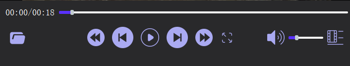

<h1 align="center">CineSync Leeds   </h1>

   <h3 >-XJCO2811-User-Interfaces-CWK-</h3>

### Introduction: 
Our team's program is a video player based on qt5.15.2, which supports Windows/Mac OS, Linux to play .wmv/.mp4, .MOV format video(Windows platforms can only play videos in .wmv format, while MacOS and Linux platforms can only play videos in .mp4 and .MOV formats). The interface of a video consists of a playarea, a menu, a playlist and a top tool bar. Video functions include  play pause, switch up and down video, fast forward and backward, volume adjustment, switch full screen, like function , switch language, video speed adjustment, customize the interface background color, screenshot function, keyboard shortcut, FAQ  and etc. At the same time, the program interface meets the needs of adaptive, suitable for any screen size.

### system requirement：
+ Windows 10/11, MacOS Linux
+ At least 4GB of RAM

### Functional guidance：

1. Play and pause: Click the play button in the middle of the video to switch between play and pause. 
2. Switch video: You can switch between the next and last video by clicking button of next video and button of last video next to the play and pause button, or you can click any video directly in the video list to play it. 
3. Fast Forward and Back: Click the fast forward and back buttons next to button of next video and button of last video to fast forward or back forward the video by two seconds. 
4. Progress dragging: You can drag the video to any playback time by dragging the slider that shows the progress of the video.
5. Volume adjustment: You can drag the volume slider in the menu bar to adjust the volume, or you can directly click the volume button to mute and unmute. 
6. Switch to Full screen: Click the full screen button of the menu, and the video will be enlarged to full screen. After the full screen, click the button again to exit the full screen. 
7. Viewing mode: Double-click the screen, you can enter the viewing mode. The viewing mode will not show any tool buttons, allowing the user to focus on watching the video. Double-click again to exit viewing mode. 
8. Like button: In the playlist, you can directly click the small red heart button of each video in playlist. After clicking, you can see that the button changes color. Also, after selecting the fourth button in topbar which looks like '...', you can select the small red heart button to like the video.

8. Switch languages: Select the first button  in topbar which called 'language' to switch languages, realize the mutual switch between Chinese and English, and realize the internationalization of the program. 
9. Video speed adjustment: Select the second button in topbar which called 'speed' to select the speed at which the video plays, you can choose 0.5, 0.75, 1.0, 1.5 and 2.0 these speeds to play the video.
10. Customize the background: Select the third button in topbar which called 'UI color' to customize the background color to meet the different needs of all users. 
11. Screenshot: After selecting the fourth button in topbar which looks like '...', you can select the screenshot function. After taking a screenshot, you can take a screenshot of the interface and save the picture to the local. 
12. Video Preview: When the mouse moves over the playlist. The selected video will be shown in a small window to give viewers a preview of the effect. 
13. Responsive: The program is designed to fit any size. When the interface is too wide, the playlist will move from the bottom to the right, click the list button on the far right of the menu, and the playlist will pop up from the right, which is to adapt to the tablet size.
14. Keyboard shortcut: The space bar corresponds to the play and pause of the video, the left and right keys correspond to the back and forward of the video playback, and the up and down keys correspond to the increase and decrease of the video volume key.
15. FAQ: After clicking a button similar to a question mark, a window will pop up to show the introduction of our player in both Chinese and English. There are three buttons to play the Chinese sound and pause it.

### How to run the player

- Download the .zip file of the entire project, unzip the .zip file.
- Download the QT Creator IDE and QT 5.15.2 from the QT website.
- Complete the QT 5.15.2 configuration in QT Creator(consider setting some initial internationalisation language options here).
- Open the project and open the.pro file in the folder to build the project.
- Click the Run button, and you'll get the software running.
- Click the button with the folder icon and select the folder containing the video files. You should see all the videos in the folder appear in the playlist. Click the play button next to any video to play it. Then you can implement the existing functionality on the video!
